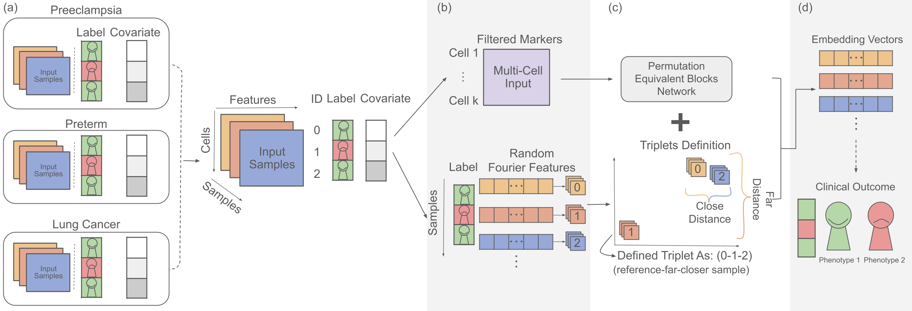

# CytoCoSet

## Introduction

CytoCoSet is a set-based encoding method, which formulates a loss function with an additional triplet term penalizing samples with similar covariates from having disparate embeddings results in per-sample representations.

<p align="center">

</p>

## Installation

### Requirements

- Python >= 3.6
- CUDA >= 10.1

```
pip install -r requirements.txt
```

### Datasets

Please download the dataset from Zenodo and follow the instruction of data structure that shown in Zenodo webpage description.


-   [Preeclampsia](https://doi.org/10.5281/zenodo.10659650)
-   [Preterm](https://doi.org/10.5281/zenodo.10660080)
-   [Lung Cancer](https://doi.org/10.5281/zenodo.10659930)


## Reproducing Results

### File Structure

- The model accept CSV or FCS file. Please divide the dataset into one file per-sample, each file include cell expression(rows) X features(column). 
- Data's label and covariate should save in one CSV file and named ``fcs_info.csv`` or ``csv_info.csv``.
- Markers that want to be selected into training data should store those name of columns into ``marker.csv``.

Here is the data structure of the dataset, take lung cancer as example:

data folder
- fcs_info.csv
- filenames_X(trials_number)X.json
- lung_fcs
	- all
		- X(sample_file_name)X.fcs
		- test_labels_X(trials_number)X.csv
		- train_labels_X(trials_number)X.csv
	- marker.csv
- tripletlists_X(covariate)X_X(trials_number)X
	- X(covariate)X_tripletlist_subpick_test_rffX(medianpooling_or_maxpooling)X_sameX(same_threhold_percange)X_diffX(diff_threhold_percange)X.txt
	- X(covariate)X_tripletlist_subpick_trainval_rffX(medianpooling_or_maxpooling)X_sameX(same_threhold_percange)X_diffX(diff_threhold_percange)X.txt

### Datasets Format

For ``fcs_info.csv``:
```
,file_id,condition,age,sex,EGFR,SystemicImmunosuppresiveTreatmentforAE,DrugRelatedAE
1,s1.fcs,1,69,0,1,0,0
2,s2.fcs,0,68,1,1,0,0
3,s3.fcs,0,66,1,0,1,0
...
```

For ``filenames_1(trials_number).json``:
```
train/s1.fcs
train/s2.fcs
test/s3.fcs
...
```

For ``train_labels_1(trials_number).csv`` (similar as ``test_labels_(trials_number).csv``):
```
fcs_filename,condition,age,sex,EGFR,SystemicImmunosuppresiveTreatmentforAE,DrugRelatedAE
s1.fcs,1,69,0,1,0,0
s2.fcs,0,68,1,1,0,0
...
```

For ``marker.csv``:
```
89Y_CD45,115In_Ki67,141Pr_CD137,142Nd_CD19,143Nd_CD25...
```

For triplet file, ``tripletlist_subpick_(trainval/test)_rffmedian_same0.2_diff0.2.txt``:
```
0 3 11
0 6 2
0 7 2
...
```
The number in triplet file is matching to the index number in json file. For example, ``0`` in here matching to ``s1.fcs``, and ``2`` in here matching to ``s3.fcs``.


### Triplet Generation

``dataset_RFF.ipynb`` help sample generate triplet list with different quartile by using Random Fourier Features.

### Training

* Download pre-processed datasets (see Datasets Section), unpack them and followed the file structure in Zenodo instructions.
* In ``scripts/train/train_[Dataset].sh``, set ``bin_file`` to the path of ``train.py`` and ``gpu`` to the gpu id.
* Start training: ``bash train_[Dataset].sh``

### Output

The training model will generate a csv file that include embedding vector, predict label, predict probability, true label of each sample.


## Contact

If you have any questions or need further assistance, please don't hesitate to reach out to Chi-Jane Chen at chijane@cs.unc.edu, or simply submit an issue on the Issues Dashboard. Your inquiries are always welcome!


